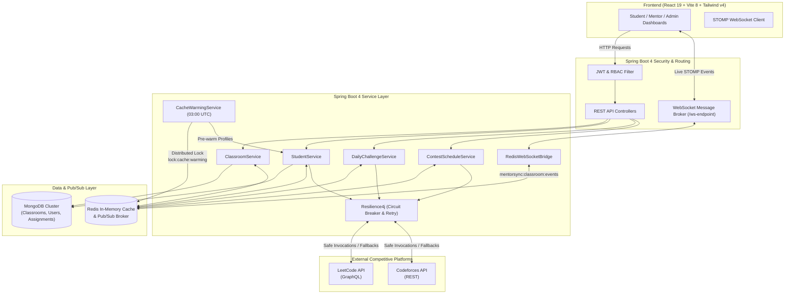

# 🚀 MentorSync — LeetCode & Codeforces LMS

<div align="center">


**A high-performance Learning Management System bridging educators, mentors, and students with automated coding assignment verification, dual-platform competitive programming telemetry, and real-time clustered leaderboards.**

[Explore Features](#-feature-highlights) • [System Architecture](#-system-architecture) • [Quickstart](#-quickstart--local-setup) • [API Reference](#-api-endpoints-reference) • [Documentation](#-project-documentation)

</div>

---

## 📖 Overview

**MentorSync** eliminates manual grading and administrative friction for coding bootcamps, university computer science departments, and competitive programming clubs. By integrating directly with **LeetCode** (GraphQL API) and **Codeforces** (REST API), MentorSync continuously tracks problem solutions, contest rating progressions, and assignment deadlines.

Mentors can create virtual classrooms, enroll students individually or in bulk via CSV, assign curated problems with strict time windows, and monitor progress on a live real-time leaderboard.

---

## ✨ Feature Highlights

### 🎯 Official LeetCode Problem of the Day (POTD)
* **Live Daily Challenge**: Directly pulls the official daily challenge from LeetCode (`activeDailyCodingChallengeQuestion`) with topic tags, difficulty pills, problem hint, and direct solve links.
* **Collaborative Classroom Ticker**: Surfaces a live classroom participation banner:  
  `"14 of 24 students in your classroom have solved today's POTD!"` — motivating peer accountability and daily problem-solving consistency.
* **Smart Redis Caching**: POTD responses are cached with a 1-hour TTL to eliminate redundant upstream calls.

### ⚔️ Live Upcoming Contests Tracker
* **Dual-Platform Schedule**: Aggregates upcoming contest schedules from both **LeetCode** (Weekly & Biweekly) and **Codeforces** (Div 1/2/3/4).
* **404 Prevention Filter**: Automatically restricts LeetCode contests strictly to active, published upcoming events (eliminating dead links to unannounced future weeks).
* **Direct Registration Links**: Generates one-click registration redirects (`https://codeforces.com/contestRegistration/{id}`) for upcoming Codeforces contests.
* **Interactive UI**: Real-time countdown clocks, duration badges, and instant platform filtering (`ALL`, `LEETCODE`, `CODEFORCES`).

### ⚡ Redis Cache Warming Worker & Distributed Lock
* **Zero Cold-Cache Lag**: Background scheduled worker runs nightly at **03:00 AM UTC** (`@Scheduled(cron = "0 0 3 * * *")`) to pre-warm student statistics (`student-progress`, `student-stats`, `student-recent`, `student-profile`). Mentors experience instantaneous **0ms** responses during peak morning hours.
* **Atomic Distributed Locking**: Acquires a Redis lock (`lock:cache:warming`, 30 min TTL) via `setIfAbsent()` to guarantee only one node warms the cache in multi-instance or Kubernetes deployments.
* **Admin On-Demand Trigger**: Secure administrative endpoint (`POST /api/admin/cache/warm`) allows instant cache re-warming at any time.

### 🔄 Real-Time Clustered WebSockets
* **STOMP over WebSocket**: Connected clients receive instant updates over `/topic/classrooms/{classroomId}` without needing manual page reloads.
* **Redis Pub/Sub Cluster Bridge**: The `RedisWebSocketBridge` publishes events to `mentorsync:classroom:events`. Clustered server instances synchronize state seamlessly, dispatching local WebSocket notifications to connected students and mentors.

### 🛡️ Enterprise Resilience & Fault Tolerance
* **Resilience4j Circuit Breaker**: Tracks upstream LeetCode API error rates. If failures exceed 50%, the circuit opens to prevent cascading timeouts, immediately serving cached Redis data.
* **Exponential Backoff Retry**: Automatically retries transient failures up to 3 times with progressive delays (2s, 4s).
* **Rate Limiting**: Throttles calls to 15 requests per 10 seconds to safeguard your server IP against third-party API throttling and bans.

### 🏫 Classroom & Assignment Management
* **Auto-Fetch Problem Titles**: Mentors simply paste a LeetCode problem URL — MentorSync automatically extracts the title slug, queries the API, and auto-populates the assignment title and difficulty.
* **Automated Verification**: Students validate homework with one click (`auto-validate`); MentorSync queries LeetCode's recent submissions to verify problem acceptance and timestamps.
* **Student Nudge System**: Mentors can trigger automated email reminders to students with overdue or pending assignments.
* **CSV Bulk Import & Export**: One-click bulk student onboarding via CSV and instant export of classroom performance metrics.

### 📊 Comprehensive Telemetry & Analytics
* **Consistency Heatmap**: Full interactive GitHub-style calendar heatmap displaying daily coding submissions.
* **Multi-Metric Leaderboard**: Sort student rankings dynamically by **Streak**, **Total Solved**, **Contest Rating**, or **Pending Assignments**.
* **Unified Contest History**: Synchronized graph displaying LeetCode and Codeforces historical rating curves and global ranks.

### 🔐 Enterprise Security & RBAC
* **Stateless JWT**: Short-lived access tokens paired with secure **HTTP-Only Refresh Cookies** that resist XSS attacks.
* **Role-Based Access Control**: Granular permissions across `STUDENT`, `MENTOR`, and `SUPER_ADMIN`.

---

## 🏛 System Architecture



---

## 🛠 Tech Stack

### Backend
* **Language & Framework**: Java 21 LTS, Spring Boot 4.0.5
* **Security**: Spring Security 6, JJWT (JSON Web Token)
* **Persistence**: Spring Data MongoDB, MongoDB 6.0+
* **Caching & Message Broker**: Redis 7.0+, Spring Data Redis, Jedis
* **Resiliency**: Resilience4j 2.2 (CircuitBreaker, Retry, RateLimiter)
* **Real-time Messaging**: Spring WebSocket, STOMP
* **Build & Testing**: Maven, JUnit 5, Mockito

### Frontend
* **UI Framework**: React 19.2, TypeScript 5.9
* **Build Tooling**: Vite 8.0 (SWC)
* **Styling**: Tailwind CSS v4.2, Radix UI Primitives, Lucide / Phosphor Icons
* **Real-Time Client**: `@stomp/stompjs` 7.3
* **Networking**: Axios with JWT refresh interceptors
* **Testing**: Vitest 5.0, React Testing Library

### Infrastructure & Deployment
* **Containerization**: Docker, Docker Compose
* **Cloud Ready**: Render (`render.yaml`), AWS, DigitalOcean

---

## 🚀 Quickstart & Local Setup

### Option 1: Docker Compose (Recommended)

Run the entire stack (MongoDB, Redis, Backend, Frontend) with a single command:

```bash
# Clone the repository
git clone https://github.com/varunkushwah31/Leetcode-Tracker-Frontend.git
cd Leetcode-Tracker-Frontend

# Launch all microservices
docker compose up -d --build
```

Access the services:
* **Frontend Application**: `http://localhost:5173` (or `http://localhost`)
* **Backend REST API**: `http://localhost:8080/api`
* **MongoDB**: `localhost:27017`
* **Redis**: `localhost:6379`

---

### Option 2: Manual Local Setup

#### Prerequisites
* **Java Development Kit (JDK) 21** or higher
* **Node.js (v18+)** and **npm**
* **MongoDB** (running on port 27017 or Atlas connection string)
* **Redis** (running on port 6379)

#### 1. Backend Setup

```bash
# Navigate to the backend directory
cd Backend

# Configure environment variables in application.properties or shell:
export MONGO_URI="mongodb://localhost:27017/LeetcodeTracker"
export REDIS_HOST="localhost"
export REDIS_PORT="6379"
export JWT_SECRET="your-super-secret-256-bit-key-min-32-chars-long"

# Run tests
./mvnw clean test

# Start the Spring Boot application
./mvnw spring-boot:run
```

The backend server will spin up on `http://localhost:8080`.

#### 2. Frontend Setup

```bash
# Navigate to the frontend directory
cd Frontend

# Install dependencies
npm install

# Configure environment variables
# Create a .env file with:
# VITE_API_BASE_URL=http://localhost:8080/api
# VITE_WS_URL=http://localhost:8080/ws-endpoint

# Run unit tests
npm test

# Start the Vite development server
npm run dev
```

Open `http://localhost:5173` in your browser.

---

## ⚙️ Environment Variables Reference

| Variable | Scope | Default | Description |
|---|---|---|---|
| `PORT` | Backend | `8080` | Port for the Spring Boot application |
| `MONGO_URI` | Backend | `mongodb://localhost:27017/LeetcodeTracker` | MongoDB connection URI |
| `REDIS_HOST` | Backend | `localhost` | Redis server hostname |
| `REDIS_PORT` | Backend | `6379` | Redis server port |
| `JWT_SECRET` | Backend | *Required* | 256-bit secret key for signing JWT tokens |
| `JWT_EXPIRATION` | Backend | `86400000` | Access token lifespan in milliseconds (24h) |
| `MAIL_HOST` | Backend | `smtp.gmail.com` | SMTP host for sending student nudges |
| `MAIL_USERNAME` | Backend | *Optional* | SMTP email username |
| `MAIL_PASSWORD` | Backend | *Optional* | SMTP app password |
| `VITE_API_BASE_URL` | Frontend | `http://localhost:8080/api` | REST API base URL |
| `VITE_WS_URL` | Frontend | `http://localhost:8080/ws-endpoint` | STOMP WebSocket endpoint |

---

## 📋 API Endpoints Reference

### 🔐 Authentication (`/api/auth`)
* `POST /api/auth/register` — Register a mentor or admin account.
* `POST /api/auth/register/student` — Register a student with LeetCode/Codeforces handles.
* `POST /api/auth/login` — Sign in, returns JWT access token and sets HTTP-Only refresh cookie.
* `POST /api/auth/refresh` — Issue fresh access token via HTTP-Only cookie.
* `POST /api/auth/logout` — Revoke session and clear cookies.

### 🎯 Challenges & Contests
* `GET /api/challenges/daily?classroomId={id}` — Retrieve today's official LeetCode POTD, metadata, and classroom solved progress.
* `GET /api/contests/upcoming?platform={ALL|LEETCODE|CODEFORCES}` — Retrieve upcoming contests with countdowns and registration links.

### 🏫 Classrooms (`/api/classrooms`)
* `POST /api/classrooms` — Create classroom (`mentorId`, `className`).
* `GET /api/classrooms/{id}/dashboard` — Fetch full classroom dashboard details.
* `POST /api/classrooms/{id}/students` — Add student to classroom.
* `DELETE /api/classrooms/{id}/students/{studentId}` — Remove student from classroom.
* `POST /api/classrooms/{id}/students/bulk` — Upload CSV to bulk-enroll students.
* `POST /api/classrooms/{id}/assignments` — Create assignment (automatically fetches problem title from URL).
* `PUT /api/classrooms/{id}/assignments/{assignmentId}/deadline` — Update assignment deadline.
* `DELETE /api/classrooms/{id}/assignments/{assignmentId}` — Remove an assignment.
* `GET /api/classrooms/{id}/leaderboard` — Get classroom real-time leaderboard.
* `GET /api/classrooms/{id}/export` — Export classroom student performance to CSV.
* `POST /api/classrooms/{id}/students/{studentId}/nudge` — Dispatch email reminder for pending tasks.

### 👨‍🎓 Students (`/api/students`)
* `GET /api/students/me/dashboard` — Fetch student dashboard, heatmap, and assignments.
* `POST /api/students/me/sync` — Force profile re-sync with LeetCode & Codeforces.
* `PUT /api/students/me/handles` — Update competitive programming handles.
* `POST /api/students/me/classrooms/{cId}/assignments/{aId}/auto-validate` — Verify completion directly with LeetCode API.
* `POST /api/students/me/classrooms/{cId}/assignments/{aId}/validate` — Verify submission with submission URL.
* `GET /api/students/me/report` — Export personal progress report to CSV.

### 🛡️ Administration & Cache (`/api/admin`)
* `GET /api/admin/overview` — System health, total counts, and user metrics.
* `POST /api/admin/sync-all` — Force-sync all students across external platforms.
* `GET /api/admin/cache/stats` — Inspect Redis cache hit/miss stats and key metrics.
* `POST /api/admin/cache/clear?cacheName={name}` — Invalidate specific cache or flush all.
* `POST /api/admin/cache/warm` — Manually trigger background Cache Warming Worker.

---

## 🧪 Testing & Verification

Both backend and frontend are thoroughly tested with automated suites:

```bash
# Run 96 Backend JUnit tests
cd Backend
./mvnw clean test

# Run 66 Frontend Vitest tests
cd ../Frontend
npm test
```

---

## 📚 Project Documentation

* [Backend Architecture & Guide](Backend/README.md)
* [Frontend Architecture & Guide](Frontend/README.md)
* [Redis Caching & Warming Implementation](Backend/docs/REDIS_CACHING_GUIDE.md)
* [Resilience4j Circuit Breaker & Fallback Guide](Backend/docs/RESILIENCE4J_IMPLEMENTATION_GUIDE.md)

---

## 🤝 Contributing

1. Fork the repository
2. Create your feature branch (`git checkout -b feature/amazing-feature`)
3. Commit your changes (`git commit -m 'feat: add amazing feature'`)
4. Push to the branch (`git push origin feature/amazing-feature`)
5. Open a Pull Request

---

## 📄 License

This project is licensed under the MIT License — see the [LICENSE](LICENSE) file for details.
